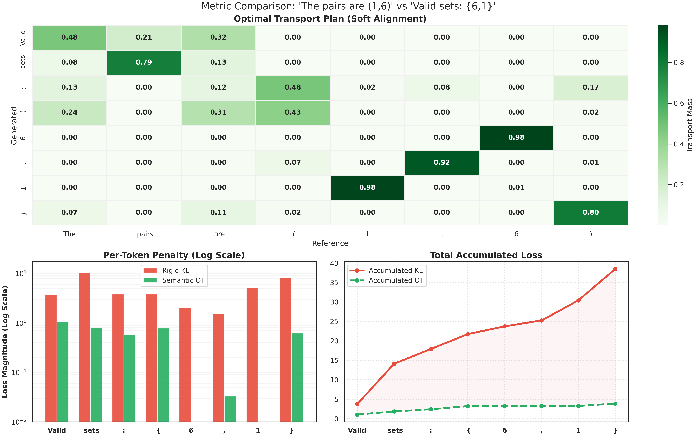

# GRPO-Mini

**GRPO-Mini** is a lightweight, hackable implementation of **Group Relative Policy Optimization (GRPO)** for fine-tuning Large Language Models (LLMs) via Reinforcement Learning.

Designed for simplicity and research, this repository provides a clean loop for **Rollout → Evaluation → Policy Update**, supporting multiple divergence constraints including standard KL divergence and Optimal Transport (Sinkhorn) distances.

## 🚀 Key Features

* **Minimalist Codebase:** Core logic is contained within `src/`, making it easy to read and modify.
* **Multiple Loss Objectives:**
    * **KL Divergence:** Standard PPO-style constraint.
    * **Approximate KL:** Stable approximation for variance reduction.
    * **Optimal Transport (OT):** Uses a robust Sinkhorn algorithm to align embedding distributions.
* **Efficient Training:** Includes `MemoryEfficientAdamW` and supports left-padding for efficient batch generation.
* **Multi-Model Support:** Configs ready for 0.5B, 3B, and 7B models (e.g., Qwen, Llama).
* **Integrated Logging:** Built-in TensorBoard support for tracking rewards, entropy, and loss.

## 📂 Directory Structure

```text
.
├── main.py                  # Entry point for training
├── results_reading.ipynb    # Results collection and visualization
├── src/
│   ├── train_grpo.py        # Core training loop & policy logic
│   └── rl_datasets.py       # Dataset loaders (GSM8K, Math, Countdown)
├── configs/                 # YAML configurations for various model sizes
├── runs/                    # Training logs and checkpoints
└── models/                  # Locally downloaded Hugging Face models
````

## 🛠️ Installation

Prerequisites: Python 3.12+ and CUDA-enabled GPU.

⚠️ Hardware Note: Running 3B parameter models (and larger) typically requires an 80GB GPU (e.g., A100, H100) to handle the memory overhead of GRPO rollouts and gradients. 0.5B models can run on smaller consumer GPUs (24GB+).

1.  **Clone the repository:**

    ```bash
    git clone https://github.com/Studeas/GRPO-mini.git
    cd grpo-mini
    ```

2.  **Install dependencies:**
    It is recommended to use a virtual environment.

    ```bash
    # install with uv(Recommended)
    uv sync

    # Install with development tools (Ruff, etc.)
    pip install ".[dev]"

    # OR standard install
    pip install -r requirements.txt
    ```

## 🏃 Usage

To start training, run `main.py` with a configuration file and a dataset name.

### Basic Command

```bash
python main.py \
    --config configs/configs_3b_ot/config_ot_beta0.1_target0.05_w8_3b.yaml \
    --dataset_name countdown
```

### Arguments

  * `--config`: Path to the YAML configuration file (defines model, learning rate, loss type, etc.).
  * `--dataset_name`: The task to train on. Choices:
      * `countdown`: A number game task (Reported).
      * `gsm8k`: Grade School Math 8K.
      * `math`: Advanced Math problems.

### Configuration

Configurations are organized by model size and loss type. Example structure of a config file:

```yaml
model:
  pretrained_model_path: "Qwen/Qwen2.5-3B-Instruct"
  dtype: "bfloat16"
  device: "cuda"

training:
  loss_type: "ot"         # Options: "ot", "kl", "approx_kl"
  beta: 0.1               # Coefficient for the divergence penalty
  learning_rate: 1e-6
  batch_size: 16
  micro_batch_size: 4
  inference_batch_size: 32 # Batch size used during generation/rollout
  max_gen_len: 128
  ot_window: 16           # Window size for Sinkhorn (if using OT)
```

## 📊 Monitoring

Training metrics (Reward, Loss, Entropy, KL/OT Distance) are logged to TensorBoard.

```bash
tensorboard --logdir runs
```

## 🧠 Algorithm Details

This implementation follows the **Group Relative Policy Optimization** paradigm:

1.  **Group Rollout:** Generates $G$ outputs for each prompt in the batch.
2.  **Reward Normalization:** Rewards are normalized relative to the group mean/std, reducing the need for a separate Value model (Critic).
3.  **Policy Update:** The policy is updated to maximize the advantage while staying close to the reference model using a specified divergence metric (KL or Optimal Transport).

## 🖼️ Visualization: Semantic OT vs. Rigid KL

One of the core features of **GRPO-Mini** is the implementation of **Optimal Transport (Sinkhorn)** loss, which provides a more flexible training signal than standard KL Divergence.

The visualization below demonstrates a scenario where the model generates a semantically correct answer that differs in phrasing and order from the reference.



### What this graph shows:
* **The Scenario:**
    * **Reference:** "The pairs are (1, 6)"
    * **Generated:** "Valid sets: {6, 1}"
* **Top (Heatmap):** The **Optimal Transport Plan** automatically finds the semantic alignment between tokens. Notice how it matches "1" to "1" and "6" to "6" despite the swapped order, and aligns "sets" with "pairs".
* **Bottom Left (Bar Chart):** **Rigid KL (Red)** penalizes the model heavily at every step because the tokens don't match exactly position-for-position. **Semantic OT (Green)** yields a much lower loss because it recognizes the content is correct.
* **Bottom Right (Line Chart):** The accumulated loss for KL explodes, potentially destabilizing training, while OT remains low and stable, encouraging the model to focus on **meaning over formatting**.